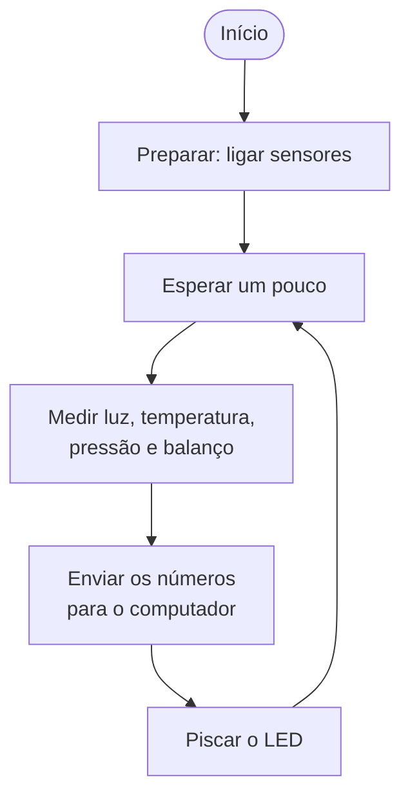
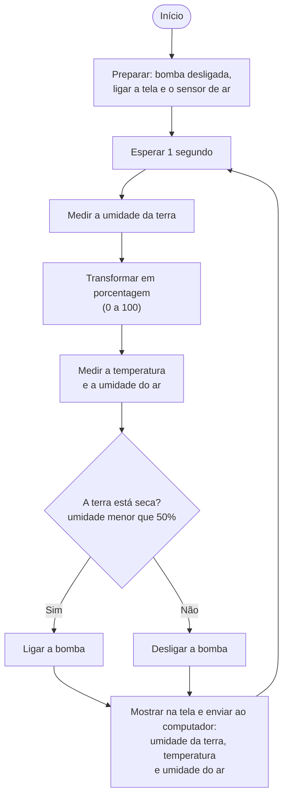

# Como os programas funcionam

Resumo em pseudocódigo (linguagem do dia a dia) e um diagrama simples para cada
sketch. Um programa de Arduino tem duas partes:

- **Preparar** — acontece **uma única vez**, quando a placa liga.
- **Repetir** — acontece **sem parar**, muitas vezes por segundo, até desligar.

---

## boia — `buoy.ino`

Mede o que o mar está fazendo (luz, temperatura, pressão e balanço) e envia os
números para o computador.

### Pseudocódigo

```
PREPARAR (uma vez):
    ligar a conversa com o computador
    ligar os sensores (luz, barômetro, acelerômetro)
    se algum sensor não responder: piscar o LED para sempre e parar
    escrever os nomes das colunas

REPETIR PARA SEMPRE:
    esperar um pouco
    medir a luz
    medir a temperatura e a pressão
    medir o balanço (acelerômetro)
    enviar os números para o computador
    piscar o LED uma vez
```

### Diagrama



---

## vaso — `planter.ino`

Mede a umidade da terra e a temperatura + umidade do ar, mostra tudo na tela e
liga a bomba de água quando a terra está seca.

### Pseudocódigo

```
PREPARAR (uma vez):
    ligar a conversa com o computador
    desligar a bomba
    ligar a tela (OLED)
    ligar o sensor de ar (temperatura + umidade)
    escrever os nomes das colunas

REPETIR PARA SEMPRE:
    esperar 1 segundo
    medir a umidade da terra
    transformar a medida em porcentagem (0 a 100)
    medir a temperatura e a umidade do ar
    SE a terra estiver seca (umidade da terra menor que 50%):
        ligar a bomba
    SENÃO:
        desligar a bomba
    enviar os números para o computador
    mostrar na tela: umidade da terra, temperatura e umidade do ar
```

### Diagrama



## Fazer PNGs

npx -p @mermaid-js/mermaid-cli mmdc -i FLOW.md -o FLOW.png
